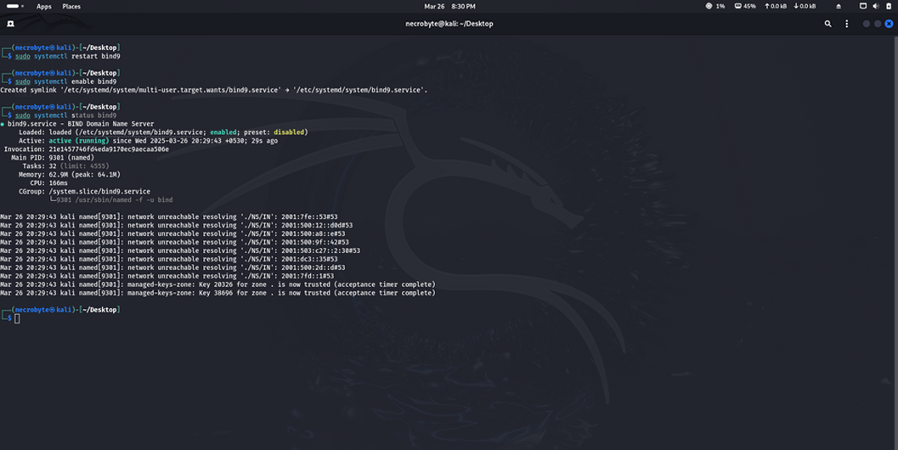
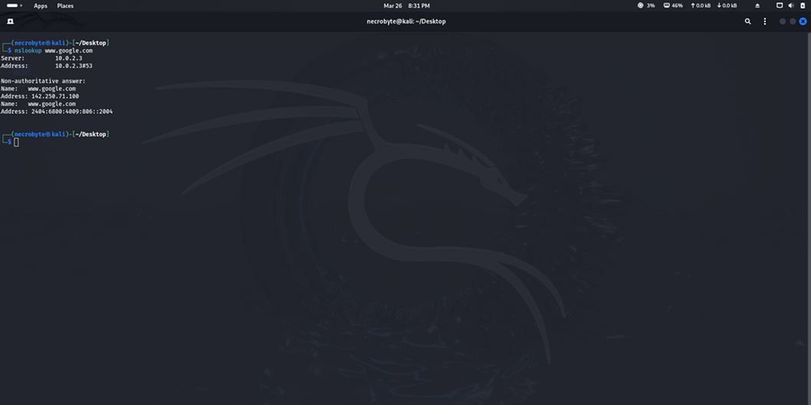
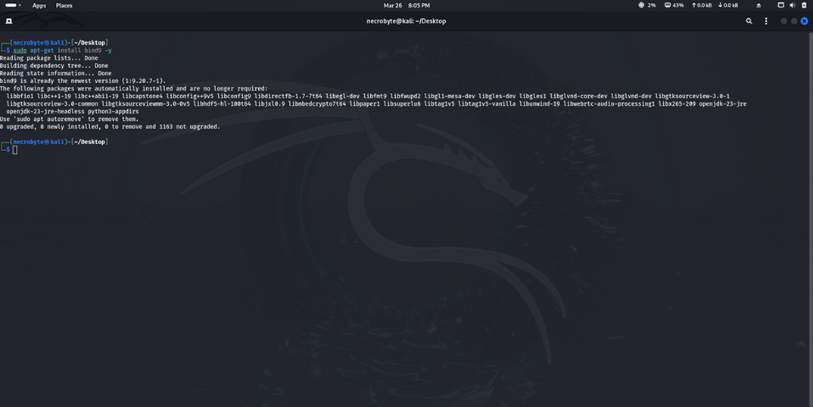
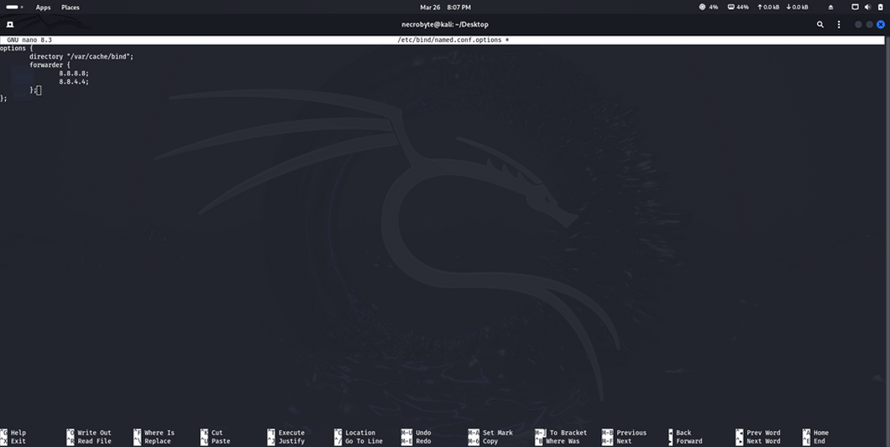

# Linux-DHCP-Server-Kali

# DHCP Server Setup on Kali Linux (ISC-DHCP-Server)

A complete, production-ready DHCP server configuration running on Kali Linux that dynamically assigns IPs in the **10.0.20.0/24** subnet.


## Why This Project Matters
- Automates IP assignment in any network (home lab → enterprise)
- Centralizes gateway, DNS, and lease management
- Essential skill for SysAdmins, Network Engineers, and Penetration Testers managing internal labs
- Demonstrates real-world Linux server administration

## Network Design
Kali Linux VM (DHCP Server)
└── Interface: eth0
├── Static IP : 10.0.20.1/24
└── Serves   : 10.0.20.10 – 10.0.20.230

## Implementation Steps
1. **Update system & install ISC DHCP Server**
   ```bash
   sudo apt update && sudo apt install isc-dhcp-server -y

  

# Specify interface
Edited /etc/default/isc-dhcp-server → INTERFACESv4="eth0"
Main configuration file → /etc/dhcp/dhcpd.conf
(Full working config included in this repo as dhcp.conf)


# Global options
option domain-name "lab.local";
option domain-name-servers 8.8.8.8, 8.8.4.4;

default-lease-time 600;
max-lease-time 7200;

# Subnet declaration
subnet 10.0.20.0 netmask 255.255.255.0 {
  range 10.0.20.10 10.0.20.230;
  option routers 10.0.20.1;
  option broadcast-address 10.0.20.255;
}


# Enable and start service
sudo systemctl enable isc-dhcp-server

sudo systemctl start isc-dhcp-server


# Verification
sudo systemctl status isc-dhcp-server
→ Service active and listening on eth0


# Files Included
dhcp.conf → Ready-to-use configuration
screenshots/ → Full visual proof


-----------------------------------------------
-----------------------------------------------
-----------------------------------------------
-----------------------------------------------

## DNS Server (BIND9) – Completed
Caching + forwarding name server. Resolves external domains instantly using local cache and Google Public DNS as upstream.




**Key Features**
- Local caching (speeds up repeated lookups)
- Forwarders: 8.8.8.8 & 8.8.4.4
- Allows queries from localhost + 10.0.20.0/24
- DNSSEC validation enabled

  ## Implementation Steps
1. **Update system & install DNS Bind9 Server**
   ```bash
   sudo apt install Bind9 -y

  

2.  # Specify interface
Edited /etc/bind/named.conf.options 
Main configuration file → /etc/bind/named.conf




Next Steps (Planned)

Chrony NTP Server
Apache2 + PHP Web Server
SSH Hardening + Fail2Ban
